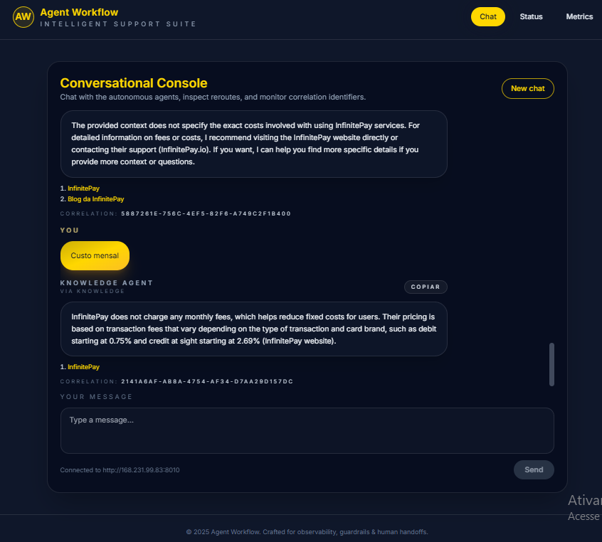
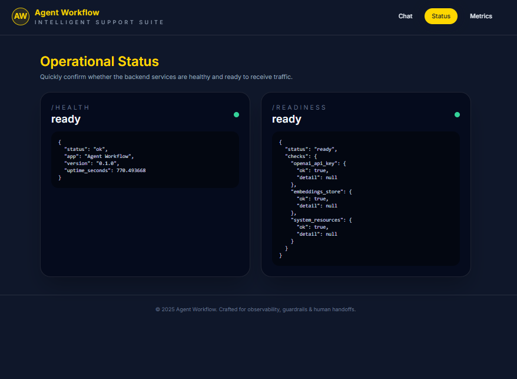
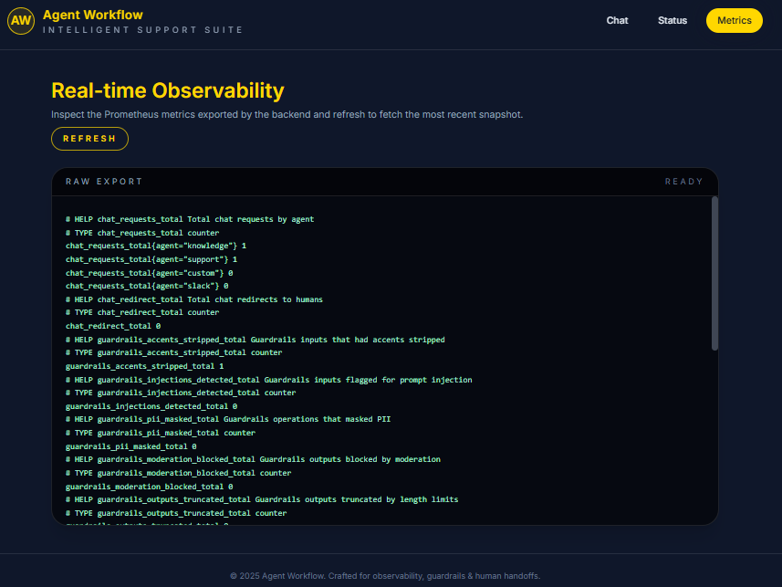

# Agent Swarm Platform

A production-ready multi-agent platform that orchestrates router, knowledge, support, and human hand-off agents to answer InfinitePay customer questions. The stack pairs a FastAPI backend, a React/Vite frontend, and a Retrieval Augmented Generation (RAG) pipeline grounded in official InfinitePay content. **OpenAI** models are required for routing, retrieval augmentation, and language generation.

## Author
- Jefferson Rodrigo Schuertz (senior data engineer and project maintainer)

> **Live demo:** http://168.231.99.83:8011/








## Unit Test Coverage
- Command: `python -m pytest --cov=app --cov-report=term`
- Result: **86% line coverage (28 Sep 2025 01:40 UTC)**

## Repository Structure
```
.
|-- agent-workflow/
|   |-- app/
|   |   |-- agents/                 # Router, knowledge, support, custom, Slack
|   |   |-- guardrails/             # Normalisation, moderation, safety filters
|   |   |-- observability/          # Logging, metrics, tracing, readiness
|   |   `-- services/               # LLM, RAG, support tools, Slack client, search
|   |-- data/
|   |   `-- rag/                    # RAG artefacts (raw pages, chunks, manifests)
|   |-- scripts/                    # RAG pipeline helpers and maintenance tasks
|   `-- tests/                      # Pytest suites for agents, guardrails, APIs
|-- app/                            # Standalone scripts for offline RAG runs
|-- frontend/
|   |-- public/                     # Static assets served by Vite
|   |-- src/                        # React components, pages, shared libs
|   `-- tests/                      # Placeholder for Vitest/RTL suites
|-- data/                           # Generated artefacts when running from repo root
|-- scripts/                        # Convenience wrappers around backend scripts
|-- Dockerfile.backend              # Uvicorn + FastAPI image
|-- Dockerfile.frontend             # Nginx + static frontend image
|-- docker-compose.yml              # Local topology for backend/frontend containers
`-- requirements.txt                # Backend dependency lock file
```

> **Need the deep dive?** Backend internals, module layout, and the full environment variable reference formerly documented in `agent-workflow/README.md` are consolidated below under [Backend Internals & Environment Guide](#backend-internals--environment-guide).

## Architecture Overview

### Message Topology
1. `POST /chat` hits Guardrails (prompt-injection filtering, PII masking, moderation, quotas).
2. `RouterAgent` classifies intent (knowledge, support, custom, Slack) and triggers redirects when confidence is low.
3. Specialised agents craft responses: Knowledge (RAG + citations), Support (tool orchestration), Custom (fallback), Slack (human escalation).
4. Responses carry telemetry (`correlation_id`, latency, guardrail flags) exported through `/metrics`.

### Agent Responsibilities
| Agent | Scope | Key Modules |
| --- | --- | --- |
| RouterAgent | Intent detection, OpenAI classification, heuristics fallback, accent normalisation. | `agent-workflow/app/agents/router_agent.py` |
| KnowledgeAgent v2 | Retrieval augmented answers, caching, reranking heuristics, optional web search. | `agent-workflow/app/agents/knowledge_agent_v2.py` |
| CustomerSupportAgent v2 | FAQ, tickets, policies, profile retention, account status, escalation control. | `agent-workflow/app/agents/support_agent_v2.py`, `agent-workflow/app/services/support_service.py` |
| CustomAgent | Structured fallback for out-of-scope queries. | `agent-workflow/app/agents/custom_agent.py` |
| SlackAgent | Confirmation workflow, Slack payload formatting, retry-aware metrics. | `agent-workflow/app/agents/slack_agent.py` |

### Guardrails and Observability
- Accent and symbol stripping, prompt-injection detection, PII masking, moderation, and output truncation on every request.
- Structured JSON logging with propagated `correlation_id`.
- Prometheus metrics per agent, including latency histograms, guardrail counters, redirect totals.
- `/health` and `/readiness` monitor uptime, CPU/memory thresholds, and dependency state.

## Backend-Frontend Interaction
- Frontend consumes the API via `VITE_API_BASE_URL` (set in `frontend/.env` or passed at build time).
- Backend whitelists UI origins with `FRONTEND_ALLOWED_ORIGINS` (comma-separated domains or IP:ports).
- On VPS/VM deployments (Hostinger or similar) export matching variables during container creation:
  - `VITE_API_BASE_URL=https://api.yourdomain.com`
  - `FRONTEND_ALLOWED_ORIGINS=https://app.yourdomain.com`
  - Optional helper: `BACKEND_BASE_URL` to document the public API URL for operators.
- Docker images honour environment variables supplied via `docker run -e`, Compose files, or `.env`.

## Product Strategy & Design Decisions
- **Multi-agent routing** keeps responsibilities focused and telemetry granular.
- **RAG grounding** anchors knowledge answers to InfinitePay content with citations and cached context.
- **Guardrails-first pipeline** blocks prompt injection, masks PII, and enforces safe outputs.
- **Deliberate human hand-off** (SlackAgent) captures low-confidence or blocked scenarios with audit trails.
- **Observability** delivers logs, metrics, and readiness probes for rapid diagnosis.
- **Reproducible ops** rely on Docker, docker-compose, ingestion scripts, and automated tests.
- **Knowledge evolution** manages manifests, TTL caches, and reranking heuristics for incremental updates.

## RAG Ingestion Pipeline
1. **Load** - Crawl URLs from `data/rag/sources/seed_urls.txt` with depth, timeout, pacing controls.
2. **Clean** - Strip chrome, deduplicate paragraphs, hash content for idempotency.
3. **Split** - Chunk documents with overlaps; capture metadata (title, order, canonical URL).
4. **Embed** - Generate embeddings via `text-embedding-3-small`; persist with chunk metadata.
5. **Index** - Emit manifest JSONL files, caches, hashed registries under `data/rag/index/`.

`python scripts/run_rag_dry_run.py` executes offline through the split stage; `python scripts/run_rag_pipeline.py` runs the full ingestion (requires network + OpenAI credentials). KnowledgeAgent v2 uses reranking heuristics (`title_boost`, `exact_term_boost`, `length_penalty`), query caching, fallbacks, and optional web search for low-recall queries.

## Frontend Experience
- **Chat Console** - Agent-tagged conversation view with citations, clipboard helpers, `correlation_id` display (`frontend/src/components/Chat.tsx`).
- **Status Page** - Displays `/health` and `/readiness` payloads (`frontend/src/pages/Status.tsx`).
- **Metrics Page** - Streams Prometheus exposition with refresh/export controls (`frontend/src/pages/Metrics.tsx`).

## Deployment Playbooks

### Render (backend) + Vercel (frontend)
**Render Web Service**
1. Runtime: Python 3.11+. Command: `uvicorn app.main:app --host 0.0.0.0 --port 8000`.
2. Environment variables: `OPENAI_API_KEY`, `FRONTEND_ALLOWED_ORIGINS=https://your-frontend.vercel.app`, `METRICS_ENABLED=true` (plus any Slack/web search configuration).
3. Health check: `/health`.

**Vercel project**
1. Root directory: `frontend`. Framework preset: Vite.
2. Build command: `npm run build`. Output: `dist`.
3. Environment variables: `VITE_API_BASE_URL=https://your-backend.onrender.com`.
4. Deploy and align CORS by extending `FRONTEND_ALLOWED_ORIGINS` when adding custom domains.

### Docker-first VPS (Hostinger or similar)
```bash
git clone https://github.com/<your-user>/swarm-agent.git
cd swarm-agent
cp .env.example .env

docker build -t agent-backend -f Dockerfile.backend .
docker build -t agent-frontend -f Dockerfile.frontend .

docker run -d --name agent-backend \
  -p 8000:8000 \
  -e OPENAI_API_KEY=sk-... \
  -e FRONTEND_ALLOWED_ORIGINS="https://app.yourdomain.com" \
  -e SLACK_ENABLED=false \
  agent-backend

docker run -d --name agent-frontend \
  -p 80:80 \
  -e VITE_API_BASE_URL="https://api.yourdomain.com:8000" \
  agent-frontend
```
Optional orchestration:
```bash
export FRONTEND_ALLOWED_ORIGINS=https://app.yourdomain.com
export VITE_API_BASE_URL=https://api.yourdomain.com:8000
docker compose up -d --build
```

### Local Development (Linux/Ubuntu)
```bash
sudo apt update && sudo apt install -y python3 python3-venv nodejs npm docker.io docker-compose-plugin

# Backend
cd agent-workflow
python -m venv .venv
source .venv/bin/activate
pip install -r requirements.txt
cp .env.example .env
uvicorn app.main:app --host 0.0.0.0 --port 8000
```
```bash
# Frontend
cd frontend
npm ci
cp .env.example .env
npm run dev -- --host 0.0.0.0 --port 5173
```

### Linux VM After Cloning
```bash
sudo apt update
sudo apt install -y python3 python3-venv git nodejs npm docker.io docker-compose-plugin

git clone https://github.com/<your-user>/swarm-agent.git
cd swarm-agent/agent-workflow
python -m venv .venv
source .venv/bin/activate
pip install -r requirements.txt
cp .env.example .env
export OPENAI_API_KEY=sk-...
export FRONTEND_ALLOWED_ORIGINS="https://your.domain"
uvicorn app.main:app --host 0.0.0.0 --port 8000
```
```bash
cd ../frontend
npm ci
cp .env.example .env
sed -i 's#http://127.0.0.1:8000#http://VM_PUBLIC_IP:8000#' .env
npm run build
npx serve dist --listen 0.0.0.0:4173
```

## Build & Run Quick Reference
- Backend: `python -m venv .venv && source .venv/bin/activate && pip install -r requirements.txt && uvicorn app.main:app --reload`
- Frontend: `npm install && npm run dev`
- Full stack (Docker): `docker compose up --build`
- Individual images: `docker build -f Dockerfile.backend -t agent-backend .` and `docker build -f Dockerfile.frontend -t agent-frontend .`

## Environment Configuration
Copy `.env.example` to  `agent-workflow/.env` and adjust:
- **OpenAI**: `OPENAI_API_KEY`, `OPENAI_MODEL`, `OPENAI_EMBEDDING_MODEL`
- **Retrieval**: `RAG_ENABLED`, `RAG_TOP_K`, `RAG_MIN_SCORE`, `RAG_MAX_CONTEXT_CHARS`, `RAG_DIAGNOSTICS_ENABLED`
- **Web Search**: `WEB_SEARCH_ENABLED`, `WEB_SEARCH_PROVIDER`, `WEB_SEARCH_API_KEY`
- **Support Tools**: `SUPPORT_FAQ_ENABLED`, `SUPPORT_FAQ_SCORE_THRESHOLD`, `SUPPORT_TICKETS_PERSIST_TO_FILE`, `SUPPORT_ESCALATION_AUTO`, `SUPPORT_PII_MASKING_ENABLED`
- **Guardrails**: `GUARDRAILS_ENABLED`, `GUARDRAILS_MODE`, `MAX_INPUT_CHARS`, `MAX_OUTPUT_CHARS`, `NORMALIZE_REMOVE_ACCENTS`, `ANTI_INJECTION_ENABLED`, `MODERATION_ENABLED`
- **Slack/Handoff**: `SLACK_ENABLED`, `SLACK_MODE`, `SLACK_WEBHOOK_URL` or `SLACK_BOT_TOKEN`, `SLACK_DEFAULT_CHANNEL`, `HANDOFF_CONFIRM_TTL_SECONDS`
- **Observability**: `METRICS_ENABLED`, `LOG_FORMAT`, `CORRELATION_ID_HEADER`, `READINESS_ENABLED`, `READINESS_CPU_THRESHOLD`, `READINESS_MEMORY_THRESHOLD_MB`
- **Frontend**: `FRONTEND_ALLOWED_ORIGINS`; replicate the API URL in `frontend/.env` via `VITE_API_BASE_URL`

Missing OpenAI credentials trigger RouterAgent heuristics while KnowledgeAgent continues serving cached RAG answers.

## Smoke Tests & Collections
- Run `./smoke-tests.sh` locally (defaults to `BASE_URL=http://localhost:8000`) or target remote deployments: `BASE_URL=https://api.example.com ./smoke-tests.sh`.
- Import `collections/agent-workflow.postman_collection.json` into Postman/Insomnia for manual verification.

## Support Tooling Detail
1. **FAQTool** - cosine-matched answers sourced from `data/support/faq.json` (boleto/device flows included).
2. **TicketTool** - in-memory or file-backed ticket creation with masked snapshots (`GET /support/tickets/{id}`).
3. **UserProfileTool** - extracts user metadata, masks PII, reuses profiles between requests.
4. **AccountStatusTool** - explains blocked transfers or limits using `data/support/account_status.json` before escalation.

## RAG Source Catalogue
`data/rag/sources/seed_urls.txt` includes `/maquininha`, `/maquininha-celular`, `/tap-to-pay`, `/pdv`, `/receba-na-hora`, `/gestao-de-cobranca`, `/gestao-de-cobranca-2`, `/link-de-pagamento`, `/loja-online`, `/boleto`, `/conta-digital`, `/conta-pj`, `/pix`, `/pix-parcelado`, `/emprestimo`, `/cartao`, `/rendimento`. KnowledgeAgent v2 always cites these (or trusted external results when web search is enabled).

## Slack & Handoff Flow
SlackAgent registers pending escalations, requests confirmation, and sends formatted payloads (mock or real mode). Responses surface `ticket_id`, `category`, `priority`, `handoff_token`, delivery status (`ok`, `failed`, `disabled`), and latency metrics for auditing.

## Guardrails & Observability Summary
- Guardrails enforce normalization, injection cleansing, masking, moderation, and truncation before/after each agent response.
- `/metrics` exposes per-agent counters and guardrail totals; `/readiness` validates runtime health; `/health` reports uptime and metadata.

## Deployment Readiness
- **Render backend**: Deploy with `Dockerfile.backend`; configure `FRONTEND_ALLOWED_ORIGINS`; rely on `/health` and `/readiness` probes.
- **Vercel frontend**: Deploy with `Dockerfile.frontend` or Vercel preset; set `VITE_API_BASE_URL` to the backend URL.

## Testing Strategy
- Backend/agents: Pytest coverage across health, routing, guardrails, metrics, RAG endpoints.
- RAG modules: unit tests for chunking, manifests, persistence.
- Frontend: manual validation via `npm run dev`; production build verification with `npm run build` and `npm run preview`.

Run backend tests with:
```bash
cd agent-workflow
pytest
```

## Challenge Coverage
| Requirement | Implementation |
| --- | --- |
| Multi-agent router | RouterAgent dispatches to knowledge, support, custom, Slack agents with telemetry. |
| Knowledge grounding | RAG pipeline ingests InfinitePay URLs; KnowledgeAgent returns cited answers and web-search fallbacks. |
| Support tooling | SupportService combines FAQ, ticketing, policies, escalation metadata. |
| HTTP API | `POST /chat` returns structured JSON with agent, content, citations, metadata. |
| Containerisation | Dockerfiles and Compose topology for backend/frontend with shared network. |
| Testing | Comprehensive pytest suite (see this README and integrated environment guide). |
| Bonus items | Slack hand-off, guardrails, redirect logic for low-confidence paths. |

## Further Enhancements
- Integrate a production Slack client + external ticketing platform.
- Add automated frontend tests (Vitest/RTL) and visual regression coverage.
- Document horizontal scaling patterns (Redis cache for RAG, OpenTelemetry tracing).
- Extend RAG whitelist with future marketing content while preserving guardrailed ingestion.

## Docker Build & Run Examples
The commands below mirror the sample you shared and include the environment variables you typically need in this project. Feel free to adapt the placeholder values for your deployment.

### 1. Create a dedicated Docker network
```bash
docker network create agentnet
```

### 2. Build the backend image (FastAPI + Uvicorn)
```bash
docker build \
  -t swarm-agent-backend \
  -f Dockerfile.backend \
  .
```

### 3. Build the frontend image (Vite build served by Nginx)
The build stage now uses `node:20-bookworm-slim`, so `@swc/core` installs cleanly. If you need to bake the API URL during build, pass it as an argument:
```bash
docker build \
  --build-arg VITE_API_BASE_URL="http://swarm-backend:8000" \
  -t swarm-agent-frontend \
  -f Dockerfile.frontend \
  .
```

### 4. Run the backend container with all required environment variables
```bash
docker run -d \
  --name swarm-backend \
  --network agentnet \
  -e OPENAI_API_KEY="sk-your-openai-key" \
  -e OPENAI_MODEL="gpt-4.1-mini" \
  -e OPENAI_EMBEDDING_MODEL="text-embedding-3-small" \
  -e FRONTEND_ALLOWED_ORIGINS="https://app.example.com,http://localhost:5173" \
  -e RAG_ENABLED="true" \
  -e WEB_SEARCH_ENABLED="false" \
  -e SLACK_ENABLED="false" \
  -e METRICS_ENABLED="true" \
  -e READINESS_ENABLED="true" \
  -p 8000:8000 \
  swarm-agent-backend
```
- `OPENAI_API_KEY` - replace with your production key.
- `FRONTEND_ALLOWED_ORIGINS` - list every domain/IP that should access the API.
- Toggle other flags (`RAG_ENABLED`, `SLACK_ENABLED`, `WEB_SEARCH_ENABLED`) to suit your deployment.

### 5. Run the frontend container pointing to the backend service
```bash
docker run -d \
  --name swarm-frontend \
  --network agentnet \
  -e VITE_API_BASE_URL="http://swarm-backend:8000" \
  -p 8080:80 \
  swarm-agent-frontend
```
- `VITE_API_BASE_URL` can use the backend container name (`swarm-backend:8000`) when both services share `agentnet`.
- Adjust the published port (`8080:80`) if a different host port is required.

With both containers running you can reach:
- Backend: `http://localhost:8000`
- Frontend: `http://localhost:8080`

Stop the stack when finished:
```bash
docker stop swarm-frontend swarm-backend && docker rm swarm-frontend swarm-backend
```


## Backend Internals & Environment Guide
- **Directory layout** mirrors the structure above with emphasis on FastAPI routers (`app/routers`), schemas (`app/schemas`), and utility modules (`app/utils`).
- **Environment setup**: `python -m venv .venv`, `source .venv/bin/activate`, `pip install -r requirements.txt`, copy `.env.example`, export OpenAI/Slack/Web Search keys as required.
- **Running the API**: `uvicorn app.main:app --reload` exposes `/docs`, `/health`, `/readiness`, `/route`, `/chat`, `/metrics`.
- **Backend tests**: Execute `pytest` for the entire suite; OpenAI interactions are mocked for deterministic runs.
- **Frontend build**: `npm run build` followed by `npm run preview` (or Nginx/Node serve) delivers the static assets consumed by Dockerfile.frontend.

All backend internals and environment references are now consolidated here; the separate `agent-workflow/README.md` file is no longer necessary.
